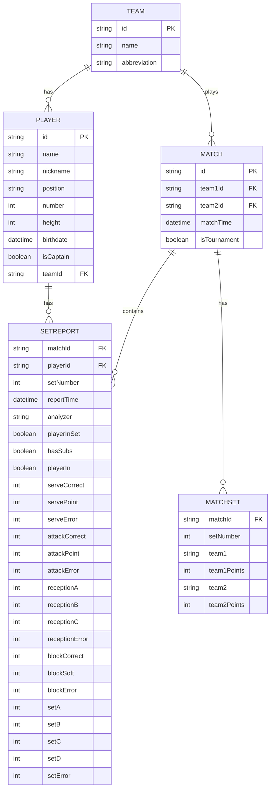

# 🏐 Volleyball Stats API

## 1. Como Inciar o servidor:

### **1. Criar um ambiente virtual (opcional)**
```bash
python -m venv venv
source venv/bin/activate  # Linux/Mac
venv\Scripts\activate  # Windows
```

### **2. Instalar as dependências**
```bash
pip install -r requirements.txt
```
### **3. Iniciar a API**
```bash
uvicorn app.main:app --reload
```

### **4. Acessar a documentação da API**
- **Swagger UI** → [http://127.0.0.1:8000/docs](http://127.0.0.1:8000/docs)
- **Redoc** → [http://127.0.0.1:8000/redoc](http://127.0.0.1:8000/redoc)

---

## 2. Estrutura do Banco de Dados

A estrutura do banco de dados utiliza **SQLite** e segue a modelagem abaixo:



---

## 3. Endpoints da API

A API expõe os seguintes endpoints:

Aqui estão os diagramas individuais para cada endpoint:

### 🏆 **Times**
| Método  | Endpoint        | Descrição                         |
|---------|----------------|-----------------------------------|
| `POST`  | `/teams/`       | Criar um novo time              |
| `GET`   | `/teams/{id}`   | Obter dados de um time          |

### 🏐 **Jogadores**
| Método  | Endpoint              | Descrição                        |
|---------|----------------------|--------------------------------|
| `POST`  | `/players/`          | Criar um novo jogador         |
| `GET`   | `/players/{id}`      | Obter informações de um jogador |
| `GET`   | `/players/{id}/reports` | Relatórios de um jogador |

### 🎮 **Partidas**
| Método  | Endpoint              | Descrição                        |
|---------|----------------------|--------------------------------|
| `POST`  | `/matches/`          | Criar uma nova partida         |
| `GET`   | `/matches/{id}`      | Obter informações de uma partida |

### 📊 **Relatórios**
| Método  | Endpoint                          | Descrição                         |
|---------|----------------------------------|---------------------------------|
| `POST`  | `/players/{id}/reports`         | Criar um relatório de desempenho |
| `GET`   | `/players/{id}/{match_id}/stats` | Estatísticas de um jogador em uma partida |

---
